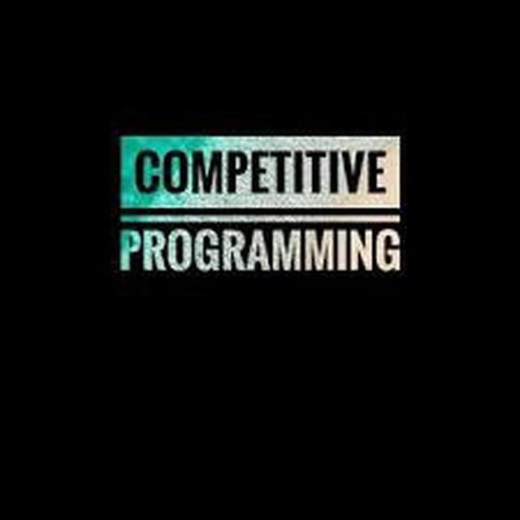
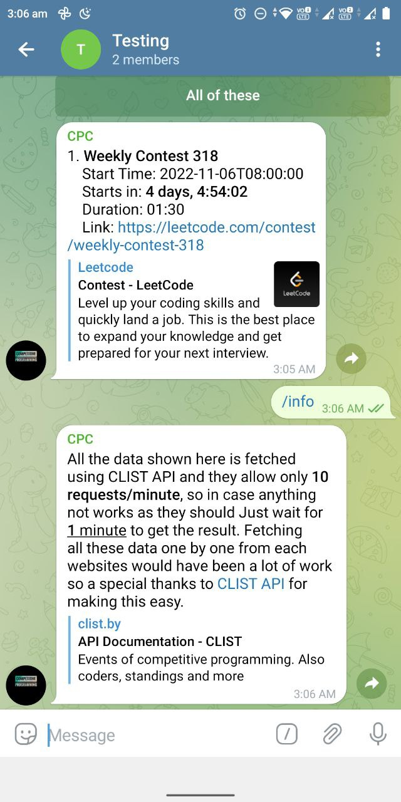

# CompetetiveProgramming-TelegramBOT

<!-- PROJECT LOGO -->
<br />
<p align="center" border-radius=50%>
  <a href="https://github.com/rAJ-1312/CompetetiveProgramming-TelegramBOT">
      
  </a>

  <h3 align="center"><a href="https://telegram.me/contestsalert_bot">CPC_Bot</a></h3>

  <p align="center">
    .
    <br>
    Click <a href="https://telegram.me/contestsalert_bot">here</a> to add it to Telegram.
    <br />
    <a href="https://github.com/rAJ-1312/CompetetiveProgramming-TelegramBOT"><strong>Explore the docs »</strong></a>
    <br />
    .
    <a href="https://github.com/rAJ-1312/CompetetiveProgramming-TelegramBOT/issues">Report Bug</a>
    <b><br>·
    <a href="https://github.com/rAJ-1312/CompetetiveProgramming-TelegramBOT/issues">Request Feature</a>
  </p>
</p>

<br />

<!-- TABLE OF CONTENTS -->
## Table of Contents
- [CompetetiveProgramming-TelegramBOT](#competetiveprogramming-telegrambot)
  - [Table of Contents](#table-of-contents)
  - [About The Project](#about-the-project)
  - [Built with](#built-with)
  - [Getting Started](#getting-started)
  - [Prerequisites](#prerequisites)
  - [Installation](#installation)
  - [Usage](#usage)
    - [Get contest details](#get-contest-details)
    - [Backend info](#backend-info)
  - [For Contribution](#for-contribution)
  - [License](#license)


<!-- ABOUT THE PROJECT -->
## About The Project

[CPC_Bot](https://telegram.me/contestsalert_bot) :
The bot is built with `python3` with the help of `pyTelegramBotAPI`. The bot fetches data from the official website of [CLIST.by](https://clist.by) and show the relevant data from the website by performing relevant api calls.
<br><br>


## Built with

* [python](https://www.python.org/downloads/release/python-3106/)
* [pyTelegramBotAPI](https://pypi.org/project/pyTelegramBotAPI/)


<!-- GETTING STARTED -->
## Getting Started

Clone the repo to get started with the bot.

## Prerequisites

* Python 3.x

## Installation
 
1. Clone the repo
```sh
git clone https://github.com/rAJ-1312/CompetetiveProgramming-TelegramBOT.git
cd CompetetiveProgramming-TelegramBOT
```
2. Installing required pip packages
```sh
pip3 install -r requirements.txt
```
3. Create a .env file in the same directory:
```sh
touch .env
```
4. Now inside that .env file you will have to insert two entries one is the BOT TOKEN which you must have got from [BotFather](https://telegram.me/BotFather) and second is the your [Clist API](https://clist.by/api/v2/doc/) token to make api calls.
```sh
BOT_TOKEN = ******************************
API_KEY = *******************************
```
<br />

5. After adding those two entries, you are good to go. Just run the program using
```sh
python3 main.py
```

<!-- USAGE EXAMPLES -->
## Usage

### Get contest details

<p align="center">
  
  
</p>

### Backend info

<p align="center">
  
</p>


<!-- CONTRIBUTING -->
## For Contribution

“One of the marvelous things about community is that it enables us to welcome and help people in a way we couldn't as individuals.” – *Jean Vanier* 
Any contributions you make are _*most welcomed*_.

Just follow these steps :smile: : 
1. Fork the Project
2. Create your Feature Branch (`git checkout -b feature/ur_feature`)
3. Commit your Changes (`git commit -m 'feat: Add some features'`)
4. Push to the Branch (`git push origin feature/ur_feature`)
5. Open a Pull Request

<!-- LICENSE -->
## License

Distributed under the MIT License. See [`LICENSE`](./LICENSE) for more information.

****
